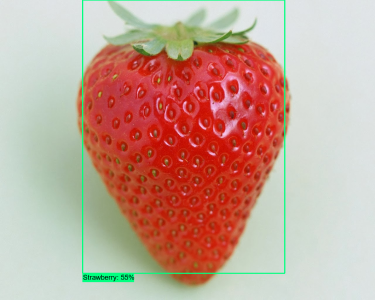
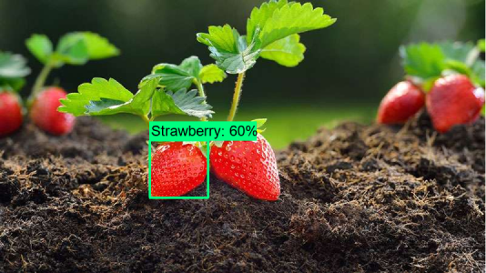
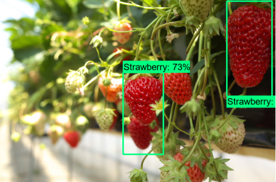
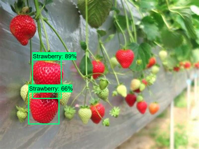
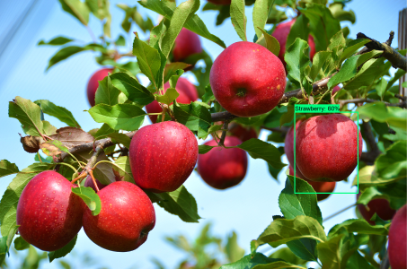

# Strawberry Identifier 🍓🧠

On the ending of 2022, I was finishing my bachelor degree and delivering my final paper to be approved.

The project developed in the final paper is a system to identify and catch ripe strawberries in a harvest based on an embedded system and artificial intelligence. You can find more details [here](https://github.com/rodrigo-orlandini/automation-eng-final-paper).

Due to some personal reasons I had less time than I want and choose to use an AI API from [Roboflow](https://roboflow.com/) instead of study and create one model from scratch.

Now, after 2 years, with time to study and a few experience about Artificial Intelligence, I decided to create this model to identify the ripe strawberries.

### Techonolgies

### Development and Results

To develop this model I used the Tensorflow Object Detection API and tried to train some different model architectures, such as MobileNet, EfficientDet and some ResNet variations. I got the best results with CenterNet ResNet and MobileNet, where the accuracy after the training achieve round of 65%.

The best results I got can be visualized in the images bellow, including successful and failed detections:

Here there a fail example, where it detected an apple as an strawberry:

To avoid this behavior, I got some similar objects and trained the model to categorize it as "Any". I did it with apples, red balls, peaches and red mushrooms.

Consider that I used a common machine (no GPUs and only 8GB RAM) to train the neural network, I wasn't be able to run some specific model architectures and I had to use just a few images (almost 20) for training. 

I couldn't upload trained models to GitHub because of it's size. You can get them using Tensorflow Object Detection API with the pipeline.config files inside models folder, tfrecords in records folder and label map. Furthermore, it's recommended to create a virtual environment to install dependency packages.

### References

[Tensorflow Object Detection Course on Youtube](https://www.youtube.com/watch?v=yqkISICHH-U&t=9438s)

[Tensorflow Object Detection Docs](https://github.com/tensorflow/models/blob/master/research/object_detection/README.md)

[Tensorflow Docs](https://www.tensorflow.org/api_docs)